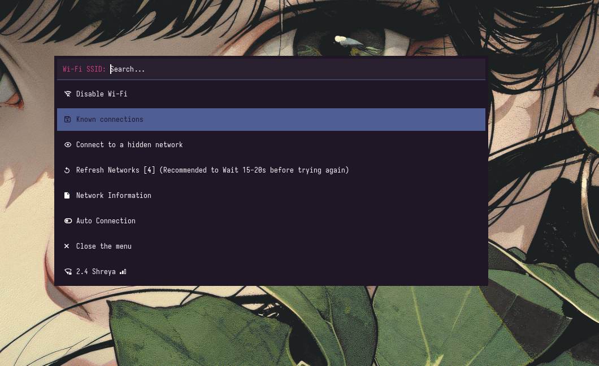

# Enhanced WiFi Menu & Status Modules



This is an updated version of the polybar themes compared to the original at https://github.com/adi1090x/polybar-themes - featuring modern enhancements like More scripts, More day to day use Models and more.


---

This package provides enhanced WiFi menu and status modules for Linux systems using NetworkManager.

## What Does This Do?

This provides two main components:

1. **wifimenu-podobu** - A WiFi connection menu that works with any launcher (wofi, rofi, etc.)
2. **network-wifi.sh** - A status module to display WiFi connection status (works with polybar or similar)

## Files Included

1. **wifimenu-podobu** - Main WiFi menu script
2. **network-wifi.sh** - WiFi status display script
3. **user_modules.ini** - Module configuration (for polybar users)
4. **README.md** - This file

---

## Features

### wifimenu-podobu Features

- Network scanning with signal strength indicators
- Saved network detection with indicator icon (󱣪)
- Disconnect by pressing Enter on connected network
- Refresh cooldown (15 seconds) with message
- SSID truncation for long network names (>70 chars)
- **"Try Again" feature** for saved networks with changed passwords (avoids system password dialog)
- Network Information menu with detailed network stats
- Auto Connection toggle to automatically connect to available saved networks
- Network count display on Refresh Networks option
- **Remove All Saved Networks** option in Known Connections (keeps current connection)
- **Back** option in Known Connections menu
- Works with any launcher (wofi, rofi, dmenu, etc.)
- Cherry theme color menu

### How "Try Again" Works (Avoiding System Password Dialog)

When connecting to a saved network where the password has changed, the OS may show a system password dialog (like KDE's). This script handles it gracefully:

1. **First Attempt**: Try to connect to the saved network using nmcli
2. **Detect Failure**: If connection fails (wrong password), the script:
   - Deletes the saved connection from NetworkManager
   - Saves the network name to a pending file (`.pending_network`)
   - Exits with code 42 to restart the menu
3. **Show as Try Again**: The network now appears in the menu with "(Try Again)" suffix
4. **User Re-enters Password**: User selects it and enters the new password
5. **Connect Fresh**: The script connects to the network with the new password and saves it

This way, users don't get stuck at system dialogs - they can re-enter passwords through the menu itself.

### network-wifi.sh Features

- Shows current connection with SSID and download speed
- Different icons based on connection state:
  - **Offline**: 󰖪 + "Offline"
  - **Connected but no internet**: 󰤣 + SSID + speed
  - **Connected with internet**:  + SSID + speed
  - **Connecting**: Cycles through 󰤯 󰤟 󰤢 󰤥 󰤨 (every half second)
- Real-time download speed calculation
- Click to open WiFi menu (when used with polybar)

### Menu Options

- **Disable Wi-Fi** - Turn off WiFi
- **Refresh Networks** - Rescan networks (shows network count [n])
- **Network Information** - View detailed network info
- **Auto Connection** (Toggle: 󰈄/󰛅) - Auto-connect to saved networks when not connected
- **Close the menu** - Exit menu
- Network list - Available WiFi networks with signal bars

### Icons Used

- 󰤪 󰤤 󰤡 - Secured networks (signal strength)
- 󰤨 󰤢 󰤟 - Open networks (signal strength)
- 󱣪 - Saved network indicator
- 󰑙 - Refresh icon
- 󰈔 - Network info icon
- 󰤣 - Connected but no internet
-  - Connected with internet
- 󰖪 - Offline
- 󰤯 󰤟 󰤢 󰤥 󰤨 - Connecting animation
- 󰈄 - Auto connection OFF
- 󰛅 - Auto connection ON

---

## Requirements

- Linux operating system
- NetworkManager (nmcli command)
- A launcher program (wofi, rofi, dmenu, wmenu, or bemenu)
- Nerd Fonts for icons
- For network-wifi.sh status: polybar or similar (optional)

---

## Installation (Step by Step for Rookies)

### Step 1: Choose Where to Put Your Scripts

Decide where you want to store your scripts. For this example, we'll use `~/wifi-scripts/`.

Replace `~/YourPath/` in all file paths with your chosen directory (e.g., `~/wifi-scripts/`).

### Step 2: Create the Directory

Open a terminal and run:
```bash
mkdir -p ~/wifi-scripts
```

### Step 3: Copy the Files

Copy the downloaded files to your new directory:
```bash
cp wifimenu-podobu ~/wifi-scripts/
cp network-wifi.sh ~/wifi-scripts/
cp user_modules.ini ~/wifi-scripts/
```

### Step 4: Make Scripts Executable

Run these commands to make the scripts executable:
```bash
chmod +x ~/wifi-scripts/wifimenu-podobu
chmod +x ~/wifi-scripts/network-wifi.sh
```

### Step 5: Check if You Have a Launcher

You need a menu launcher to use wifimenu-podobu. Check which one you have:

```bash
# Check for wofi (recommended)
which wofi

# Check for rofi
which rofi

# Check for dmenu
which dmenu
```

If you don't have any, install one. For example:
```bash
# On Arch/Manjaro
sudo pacman -S wofi

# On Ubuntu/Debian
sudo apt install wofi

# On Fedora
sudo dnf install wofi
```

### Step 6: Test the WiFi Menu

Try running the menu to see if it works:
```bash
~/wifi-scripts/wifimenu-podobu
```

You should see a menu with available networks. Use arrow keys to select, Enter to connect.

### Step 7: Create a Convenience Script (Optional)

Create a script to easily open the menu. Create a file called `wifi-menu`:
```bash
#!/bin/bash
~/wifi-scripts/wifimenu-podobu "$@"
```

Make it executable:
```bash
chmod +x ~/wifi-scripts/wifi-menu
```

Now you can run it with:
```bash
~/wifi-scripts/wifi-menu
```

### Step 8: Add to Desktop Launcher (Optional)

You can add the WiFi menu to your desktop environment's launcher:
- Copy the `wifi-menu` script to a location in your PATH, or
- Create a .desktop file in `~/.local/share/applications/`

Example .desktop file:
```ini
[Desktop Entry]
Name=WiFi Menu
Comment=Open WiFi connection menu
Exec=~/wifi-scripts/wifi-menu
Icon=network-wireless
Terminal=false
Type=Application
```

Save this as `~/.local/share/applications/wifi-menu.desktop`

### Step 9: For Polybar Users - Add WiFi Status Bar

If you use polybar and want to see WiFi status in your bar:

1. Copy `user_modules.ini` to your polybar config directory:
   ```bash
   cp ~/wifi-scripts/user_modules.ini ~/.config/polybar/forest/
   ```

2. Open your polybar config (usually `~/.config/polybar/forest/config.ini`)

3. Find the modules section and add `network-wifi`:
   ```
   modules-right = ... network-wifi ...
   ```

4. Update the paths in user_modules.ini to match your script location (replace ~/YourPath/scripts/ with ~/wifi-scripts/)

5. Restart polybar:
   ```bash
   polybar kill
   polybar &
   ```

### Step 10: Test Everything

- Test the WiFi menu by running it
- Try connecting to a network
- Test the Auto Connection feature
- If using polybar, check that the status shows correctly

---

## Customization Guide

### Changing Script Locations

If you move the scripts to a different location, you need to update:

1. **wifimenu-podobu**: Uses `SDIR="$(dirname "$0")"` to find its own location. All file references are relative to where the script is.

2. **network-wifi.sh** (line 5): Change the speed file location:
   ```bash
   # Default:
   SPEED_FILE="$HOME/.cache/wifi-speed.data"
   
   # Change to your path:
   SPEED_FILE="~/YourPath/wifi-speed.data"
   ```

3. **user_modules.ini**: Update all paths:
   - `exec` - path to network-wifi.sh
   - `label` - path to wifimenu.sh (in the click area)
   - `click-left` - path to wifimenu.sh

### Changing Default Launcher

By default, wifimenu-podobu uses wofi. To change to another launcher:

Edit wifimenu-podobu and find line ~1131 (around "launcher='wofi'"), change it:
```bash
# For rofi:
launcher='rofi'

# For dmenu:
launcher='dmenu'

# For wmenu:
launcher='wmenu'

# For bemenu:
launcher='bemenu'
```

### Key Directory References

| File | Line | Description | Default | Change To |
|------|------|-------------|---------|-----------|
| wifimenu-podobu | ~ (SDIR) | Log, pending network, refresh time, auto connect files | Script directory | `$HOME/YourPath/scripts` |
| network-wifi.sh | 5 | Speed data file | `$HOME/.cache/wifi-speed.data` | `~/YourPath/wifi-speed.data` |
| user_modules.ini | 7 | Script path | `~/YourPath/scripts/network-wifi.sh` | Your actual path |
| user_modules.ini | 15-16 | Menu wrapper path | `~/YourPath/scripts/wifimenu.sh` | Your actual path |

---

## Troubleshooting

### WiFi menu doesn't open
- Check that the path is correct
- Make sure the script is executable: `chmod +x wifimenu-podobu`
- Make sure you have a launcher installed (wofi, rofi, etc.)

### Networks not showing
- Make sure WiFi is enabled: `nmcli radio wifi on`
- Check that nmcli is working: `nmcli device wifi list`

### Icons not showing
- Install Nerd Fonts
- Make sure your terminal uses a Nerd Font

### Auto Connection not working
- Check that the `.auto_connect` file is being created in the script directory

### Connection hangs or shows system password dialog
- This is handled by the "Try Again" feature - the network will appear with "(Try Again)" and you can re-enter the password

---

## License & Credits

This is a customized version of the original wifimenu created by Jesús Arenas (podobu).  
I, Anindra Mohan Trivedi, have modified it to add modern features and improvements.

This is based on the wifimenu created by Jesús Arenas. I do not take any credit for the original work - this is merely a contribution to support modern features and enhancements.

See the original project: https://github.com/podobu/wifimenu