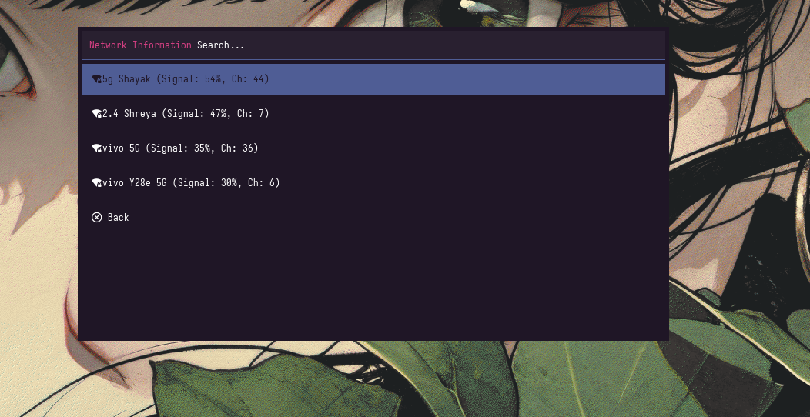
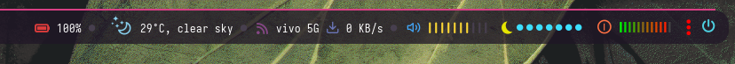
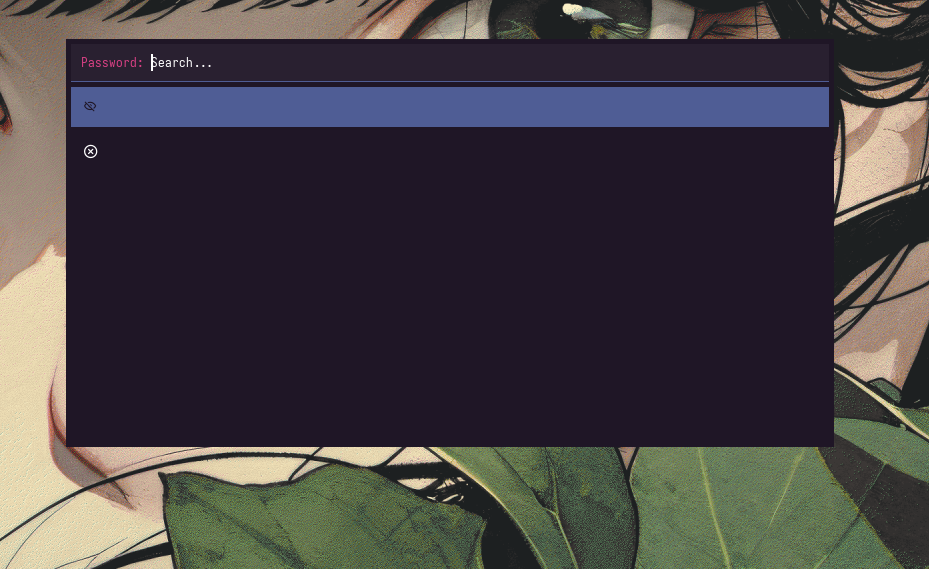

# Enhanced WiFi Menu for Linux Desktop

This package provides enhanced WiFi menu and status modules for Linux desktop.

## Files Included

1. **wifimenu-podobu** - Main WiFi menu script
2. **network-wifi.sh** - WiFi status display script
3. **user_modules.ini** - Module configuration
4. **README.md** - This file

---

## Features

- Network scanning with signal strength
- Saved network detection
- Try Again feature for changed passwords
- Auto Connection toggle
- Network Information menu
- Remove All Saved Networks option
- Works with rofi, wofi, dmenu

---

<p align="center">
  
  
  
</p>

---

## Installation

### Step 1: Create Directory
```bash
mkdir -p ~/.config/polybar/forest/scripts
```

### Step 2: Copy Files
```bash
cp wifimenu-podobu ~/.config/polybar/forest/scripts/
cp network-wifi.sh ~/.config/polybar/forest/scripts/
cp user_modules.ini ~/.config/polybar/forest/scripts/
```

### Step 3: Make Executable
```bash
chmod +x ~/.config/polybar/forest/scripts/wifimenu-podobu
chmod +x ~/.config/polybar/forest/scripts/network-wifi.sh
```

### Step 4: Create Wrapper (Optional)
Create `~/.config/polybar/forest/scripts/wifimenu.sh`:
```bash
#!/bin/bash
while true; do
    ~/.config/polybar/forest/scripts/wifimenu-podobu "$@"
    [ $? -ne 42 ] && break
done
```
Then make it executable:
```bash
chmod +x ~/.config/polybar/forest/scripts/wifimenu.sh
```

### Step 5: Update Paths in user_modules.ini
Open `user_modules.ini` in a text editor and edit these specific lines:

| Line | Edit This | Change To |
|------|-----------|----------|
| 5 | `exec = ~/YourPath/network-wifi.sh` | `exec = ~/.config/polybar/forest/scripts/network-wifi.sh` |
| 10 | `label = "%{A1:~/YourPath/wifimenu.sh &:}%output%%{A}"` | `label = "%{A1:~/.config/polybar/forest/scripts/wifimenu.sh &:}%output%%{A}"` |
| 11 | `click-left = ~/YourPath/wifimenu.sh` | `click-left = ~/.config/polybar/forest/scripts/wifimenu.sh` |

After editing, the file should look like:
```ini
;; _-_-_-_-_-_-_-_-_-_-_-_-_-_-_-_-_-_-_-_-_

[module/network-wifi]
type = custom/script
exec = ~/.config/polybar/forest/scripts/network-wifi.sh
interval = 1
tail = true
format = <label>
format-foreground = ${color.foreground}
label = "%{A1:~/.config/polybar/forest/scripts/wifimenu.sh &:}%output%%{A}"
click-left = ~/.config/polybar/forest/scripts/wifimenu.sh

;; _-_-_-_-_-_-_-_-_-_-_-_-_-_-_-_-_-_-_-_-_
```

### Step 6: Enable Module in polybar config
Open your polybar config file (e.g., `~/.config/polybar/forest/config`):

1. Find the `[module/...]` section (around line 5-10) and add:
```ini
include-file = ~/.config/polybar/forest/scripts/user_modules.ini
```

2. Find your bar section (e.g., `[bar/top]`) and add `network-wifi` to `modules-left` or `modules-right`:
```ini
[bar/top]
modules-left = network-wifi
```
Or if you want it on the right:
```ini
modules-right = network-wifi
```

**Note:** If you already have other modules listed, add `network-wifi` to the existing list (e.g., `modules-left = battery network-wifi`).

---

## Requirements

- Linux desktop
- NetworkManager
- rofi or wofi or dmenu
- Nerd Fonts

---

## Contribution

This is a customized version of the original wifimenu created by Jesús Arenas (podobu). I, Anindra Mohan Trivedi, have modified it to add modern features and improvements.

I claim no rights to the original work — only to provide additional support and styling.

## Credits

Based on wifimenu by Jesús Arenas (podobu)